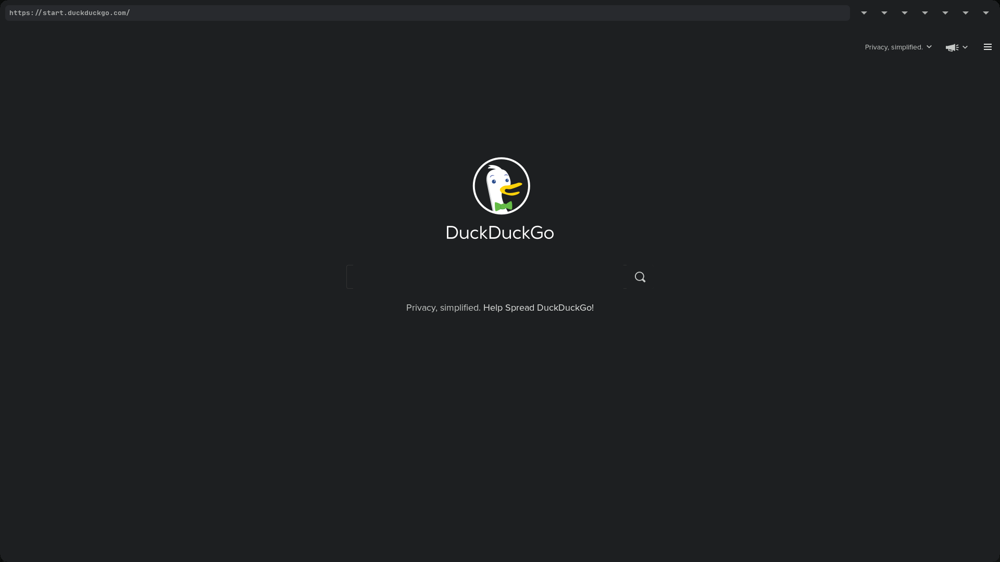
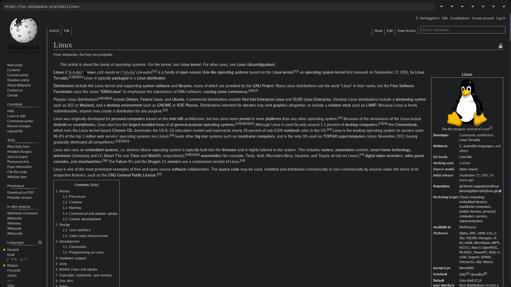

## Xupric __[alpha]__
__[Project is under heavy development!]__

A Modern Web Browser based on webkit2gtk.\
Moderately inspired by surf.

### Features
* Functional web searching
* Tabs support (10 static tabs)
* Configuration through ~/.config/sulfer/sulfer.conf
* Additional (styling, certs) configuration in ~/.config/sulfer/
* Shortcut keys
* Custom Navigation Bar made with gtkbuilder and css
* & much more

### Dependencies
* <a href="https://github.com/libconfuse/libconfuse">libconfuse</a> \<required\>
* webkit2gtk \<required\>
* meson \<required\>
* x11 \<required\>
* gtk3 \<required\>

### Install
```sh
> mkdir build && cd build
> meson ..
> ninja
> sudo ninja install 
```
NB! For a way better look, change duckduckgo's theme to __dark__.

### Showcase



### Keyboard Shortcuts
| KEY            | Action           |
| ------         | -----            |
| alt+q          | quit             |
| ctrl+r         | reload           |
| ctrl+shift+r   | reload -cache    |
| F5             | reload           |
| Esc            | stop loading     |
| F11            | fullscreen toggle|
| alt+h          | goto home/start  |
| alt+Left       | go backwards     |
| alt+Right      | go forwards      |
| ctrl+equal     | zoom in          |
| ctrl+minus     | zoom out         |
| ctrl+0         | zoom reset       |
| ctrl+Tab       | next tab         |
| ctrl+shift_Tab | previous tab     |
| alt+\<x\>      | switch to tab x  |

Tab (10 max) switching is done with alt+(tab_number from 1->0)

### Configuration
Most of the configuration is done through ~/.config/sulfer/sulfer.conf.\
And the styles are in ~/.config/sulfer/styles/

### Notes
The default sulfer is styled using the <a href="https://github.com/ChrisKempson/Tomorrow-Theme">Tomorrow Night</a> color theme.\
The cache is stored in ~/.cache/sulfer/\
Almost all the files/dirs get generated during run-time.\
There are a ton of bugs, so hold your teddy bear.
