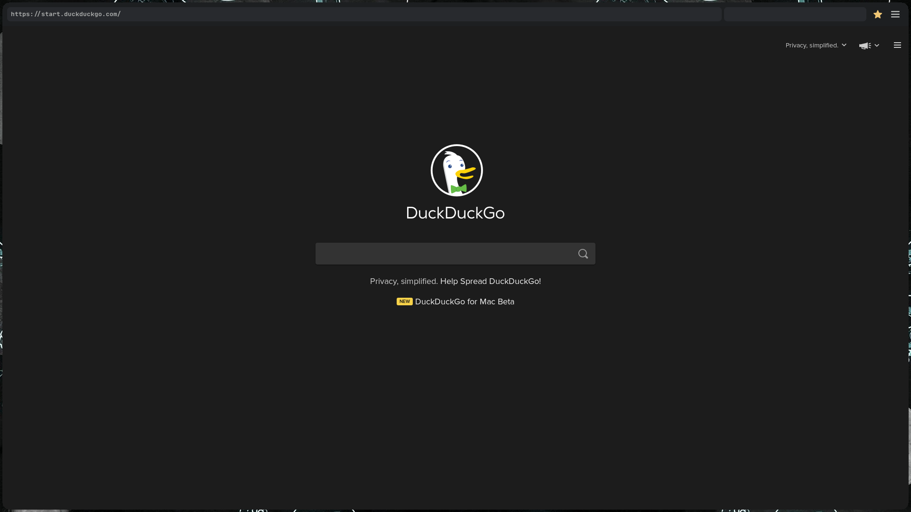
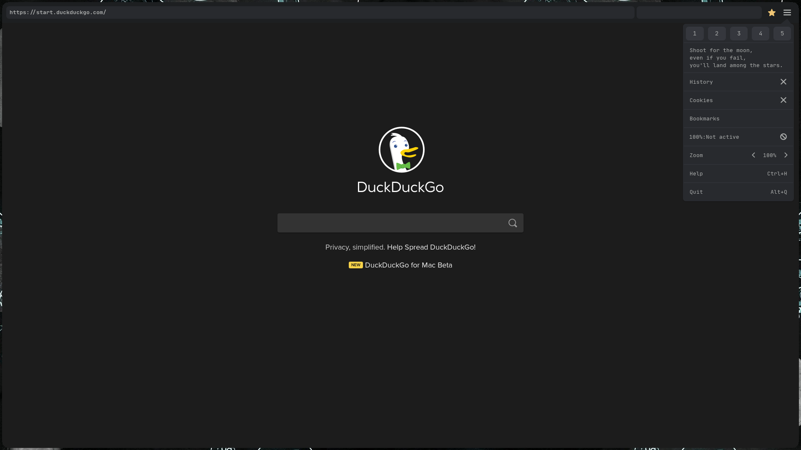
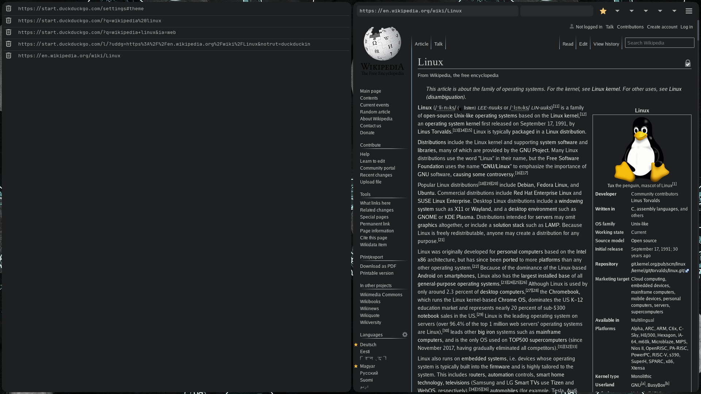

##  Xupric
__Screw it, imma work a bit more aka it's horrible:D\
Couldn't even last 3 days.__

A Modern Web Browser based on webkit2gtk.\
Moderately inspired by surf.

### Features
* Functional web searching
* Tabs support (10 static tabs)
* Configuration through ~/.config/xupric/xupric.conf
* CSS styling in ~/.config/xupric/styles/
* Dark mode (disabled by default)
* Shortcut keys
* Custom Menu & Navigation Bar
* Bookmarks, history, cookies
* & much more

### Dependencies
* <a href="https://github.com/libconfuse/libconfuse">confuse</a> \<required\>
* webkit2gtk-4.0 \<required\>
* xxd \<required\>
* sqlite3 \<required\>
* meson \<required\>
* x11 \<required\>
* gtk3 \<required\>
* <a href="https://www.nerdfonts.com/font-downloads">JetBrainsMono Nerd Font</a> \<recommended\>
* <a href="https://github.com/cbrnix/Flatery">Flatery-Dark icon theme</a> \<recommended\>
* appmenu-gtk-module \<optional\>

NB! Gtk4 and webkit2gtk-5.0 __aren't__ supported.

### Install
```sh
> mkdir build && cd build
> meson ..
> ninja
> sudo ninja install
```

### Showcase




### Keyboard Shortcuts
| KEY            | Action           |
| ------         | -----            |
| alt+q          | quit             |
| ctrl+r         | reload           |
| ctrl+shift+r   | reload -cache    |
| F5             | reload           |
| ctrl+f         | start find       |
| ctrl+n         | find next        |
| ctrl+shift+n   | find previous    |
| ctrl+b         | bookmark toggle  |
| ctrl+d         | dark mode toggle |
| ctrl+shift+d   | debug toggle     |
| ctrl+s         | download page    |
| Esc            | stop loading & finish find|
| F11            | fullscreen toggle|
| alt+h          | goto home/start  |
| alt+Left       | go backwards     |
| alt+Right      | go forwards      |
| ctrl+equal     | zoom in          |
| ctrl+minus     | zoom out         |
| ctrl+0         | zoom reset       |
| ctrl+Tab       | next tab         |
| ctrl+shift_Tab | previous tab     |
| alt+\<x\>      | switch to tab x  |

Tab (10 max) switching is done with alt+(tab_number from 1->0)

### Configuration
Most of the configuration is done through ~/.config/xupric/xupric.conf.\
And the styles are in ~/.config/xupric/styles/

### Credits
Thank you, <a href="https://github.com/Tux-Code">Tux-Code</a> for creating the logos.

### Notes
The default xupric is styled using the <a href="https://github.com/ChrisKempson/Tomorrow-Theme">Tomorrow Night</a> color theme.\
The cache is stored in ~/.cache/xupric/\
Almost all the files/dirs get generated during run-time.\
The coding style is somewhat a lazy Linux kernel like.\
My intention was to make it not look like a gtk application.\
There are a ton of bugs, so hold your teddy bear.
